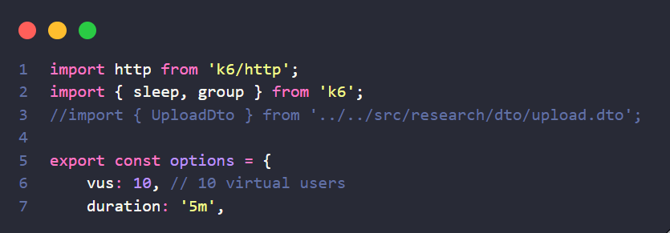
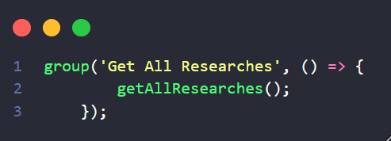
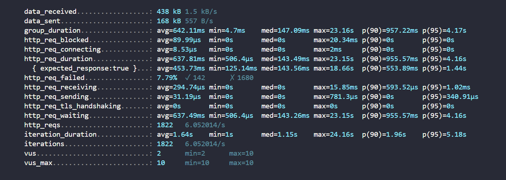

# Ponderada M9S7 - Testes de carga com o k6

## O que é o k6?

O K6 é uma ferramenta de teste de carga e desempenho desenvolvida para ajudar as equipes de desenvolvimento e operações a avaliar e otimizar o desempenho de suas aplicações e infraestrutura. Ele é projetado para ser simples de usar, escalável e oferecer insights detalhados sobre o desempenho do sistema. 
<br>
Ele permite simular milhares de usuários acessando uma aplicação simultaneamente, gerando métricas precisas sobre o desempenho, tempos de resposta, latência, e outros indicadores importantes.
<br>

## Como o K6 funciona?

O K6 funciona executando scripts de teste escritos em JavaScript. Esses scripts definem os cenários de teste, como o número de usuários virtuais, as ações que eles executam (como fazer login, navegar em páginas, enviar formulários) e as métricas a serem coletadas durante o teste.
<br>
Quando o teste é iniciado, o K6 gera tráfego simulado de usuários de acordo com o script definido. Ele mede o desempenho da aplicação em termos de carga, tempos de resposta, erros e outras métricas importantes. Esses dados são então apresentados em formatos visualmente compreensíveis, como gráficos e relatórios, para análise e tomada de decisões.

## Vantagens do k6

* Simplicidade de uso: O K6 é projetado para ser fácil de configurar e executar, mesmo para usuários iniciantes. Seu uso de scripts JavaScript simplifica a criação e personalização de testes.

* Escalabilidade: O K6 é altamente escalável, permitindo simular milhares de usuários virtuais para testar a capacidade de carga de sistemas e aplicações.

* Métricas detalhadas: Ele fornece métricas detalhadas e em tempo real sobre o desempenho da aplicação, incluindo tempos de resposta, latência, erros, throughput e muito mais.

* Integrações: O K6 oferece integrações com várias ferramentas e serviços, como Grafana, InfluxDB e outros, para análise avançada e monitoramento contínuo do desempenho.

* Código aberto: Sendo uma ferramenta de código aberto, o K6 é gratuito para uso e possui uma comunidade ativa de desenvolvedores que contribuem com melhorias e suporte.

## Execução dos teste com o k6

Visando aplicar os conceitos explicitados anteriormente, será realizado um teste de carga sobre a api do projeto realizado em parceria com a meta. Para a realização do teste, antes é necessário seguir o <a href="https://k6.io/docs/get-started/installation/">tutorial de instalação do k6</a>, e em seguida selecionar a rota escolhida para os testes.

A rota escolhida foi a `getAll`, que retorna uma lista de todas as pesquisas disponíveis no banco de dados para um usuário específico. Para isso, foi criado o arquivo `backend/test/load/load_test_A`, responsável por instanciar e executar as funções do teste de carga para essa rota. As funções responsáveis por esse teste são:




Em seguida, basta navegar até esse arquivo pelo terminal e executar o seguinte comando:

```
k6 run test_load_A
```

## Resultados obtidos

Como resultados, foi possível extrair as seguinte métricas com o teste de carga utilizando o k6:



`http_req_failed`: indica a porcentagem de vezes que a api não conseguiu concluir a requisição desjada e retornou algum erro para a chamada da api. Nesse caso, o valor de 7,79% de erro indica que, de todas as chamads, 7,79% falharam, indicando a ineficiênica da api se manter disponível 100% do tempo sobre alta demanda.

`iteration_duration`: indica o tempo que a api leva para receber uma requisição, processar uma resposta e retorná-la ao cliente da chamada. Portanto, um tempo de duração alto indica uma lentidão no serviço, que pode impactar na capacidade de lidar com todas as interações. Nesse caso, o teste mostrou um valor razoavelmente bom como tempo de resposta (1.64 segundos), embora ainda possa ser otimizado para decair em milésimos de segundo para aumentar a eficienência da api.

`http_req_blocked`: indica o tempo em que a api ficou parada devido a incapacidade de lidar com as novas requisições. Para essa métrica, o teste executado revela um valor de 89 microssegundos parado, o que é um valor consideravelmente bom visto que indica que a api não ficou nem mesmo 1 segundo travada por novas requisições.

## Conclusão

Os testes realizados indicam que essa rota da aplicação está em um caminho otimista de desenvolvimento, demonstrando bons resultados de processamento de informações e resposta às chamadas. Entretanto, ainda necessita de alguns ajustes arquiteturais para que consiga manter esse bom desempenho diante de um número elevado de requisições , reduzindo os 7,79% de indisponibilidade para 0 ou um número próximo disso.
